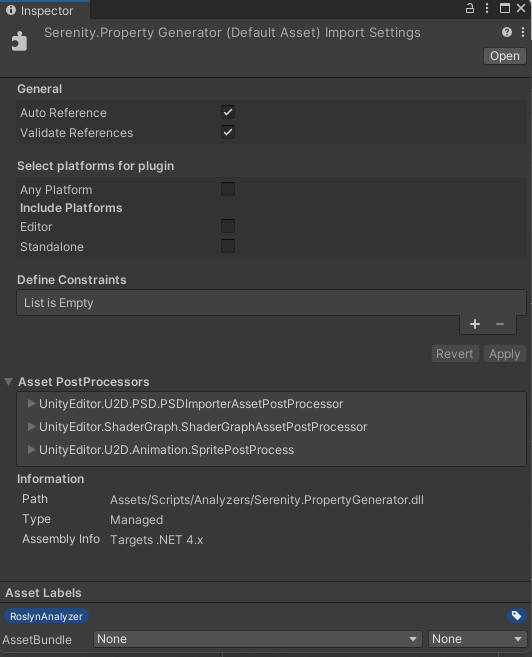

# Serenity.PropertyGenerator
[](https://raw.githubusercontent.com/serenitystudio/Serenity.PropertyGenerator/master/LICENSE)

[](https://github.com/serenitystudio/Serenity.PropertyGenerator/releases)

A Unity compatible C# source generator to create getter and setter properties for fields to make specifically readonly scriptable objects. 

If you want readonly scriptable objects, you must either write getter properties for serialized fields or add `[field: SerializedField]` to property but second options serialized as `<foo>k__BackingField` and also has other downsides. If you choose writing getter properties, you must write many boilerplate codes. This source generator writes these boilerplate code for you.

For more info about `[field: SerializedField]` [Unity Forum](https://forum.unity.com/threads/c-7-3-field-serializefield-support.573988/)

## Installation
Minimum supported Unity version is Unity `2021.2` because of `netstandard2.1` support of the project.

1. Download `Serenity.PropertyGenerator.dll` file from [Release Page](https://github.com/serenitystudio/Serenity.PropertyGenerator/releases)
2. Move the dll file into the Assets folder, or any folder nested inside of the Assets folder, in your Unity project.
3. Click on the .dll file inside the Asset Browser inside Unity to open the `Plugin Inspector` window.
4. Under the `Select platforms for plugin` heading, disable `Any Platform`. 
5. Under the `Include Platforms` heading, disable `Editor` and `Standalone`.
6. Under the `Asset Labels` heading in the Plugin Inspector window, click on the blue label icon to open the `Asset Labels` sub-menu.
7. Create and assign a new label called RoslynAnalyzer



For more information on Unity and Source Generator, please refer to the [Unity Documentation](https://docs.unity3d.com/Manual/roslyn-analyzers.html).

## Quick Start
To use the generator, add the `[Getter]` or `[Setter]` or `[Getter, Setter]` attribute to a field in partial class or struct. The attribute is also auto generated. It will generate a partial class under same namespace.

```csharp
using System;
using Serenity.Property;

namespace FooNamespace
{
    public partial class Foo : ScriptableObject
    {
        [SerializedField, Getter]
        private int _intGetterTest;

        [SerializedField, Setter]
        private int[] _intArraySetterTest;

        [Getter, Setter]
        private int _intGetterSetterTest;
    }
}
```

Source generator generates a class called `Foo.g.cs` which contains getter and setter properties. 

## Generated Properties

```csharp
namespace FooNamespace
{
    public partial class Foo : ScriptableObject
    {
        public int IntGetterTest
        {
            get => _intGetterTest;
        }

        public int[] IntArraySetterTest
        {
            set => _intArraySetterTest = value;
        }

        public int IntGetterSetterTest
        {
            get => _intGetterSetterTest;
            set => _intGetterSetterTest = value;
        }
    }
}
```

## License

Serenity.PropertyGenerator is Copyright © 2023 [Serenity Studios](https://github.com/serenitystudio) under the MIT License.